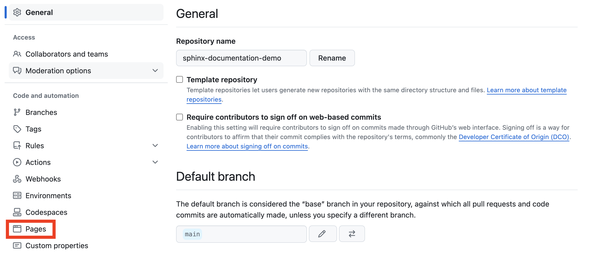
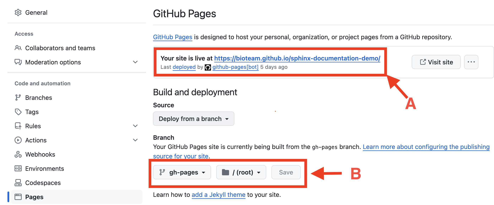

Installing Sphinx
=================

Local Installation
==================

.. tip::
    When you need to write a lot of documentation, it's a **good idea** to do it all locally. 

1. Cloning the Repo
------------------------
Clone the `sphinx-documentation-demo <https://github.com/bioteam/sphinx-documentation-demo>`_ GitHub repository into a local directory:

.. code-block:: bash

    git clone git@github.com:bioteam/sphinx-documentation-demo.git

2. Installing Sphinx 
---------------------------------
Sphinx and its extensions are *python packages* that can be installed.
The packages you need to install are in :code:`pyproject.toml` located in the :code:`sphinx-documentation-demo` repository.
It's a good idea to install them in a **virtual environment**.

2a. Using :code:`install.sh` to install
~~~~~~~~~~~~~~~~~~~~~~~~~~~~~~~~~
The :code:`install.sh` script can be used to create a new python environment and install the scripts needed for Sphinx to function.
While in the :code:`sphinx-documentation-demo` directory, run:

.. code-block:: bash

    bash install.sh

This will create a **hidden** environment folder :code:`.env` and install the packages located in :code:`pyproject.toml`.

2b. Activating environment using :code:`source.sh`
~~~~~~~~~~~~~~~~~~~~~~~~~~~~~~~~~~~~~~~~~~~~~~~~~~
After using :code:`install.sh`, or **whenever you open a new command terminal**, make sure that you **activate** the environment by running the following command while in the :code:`sphinx-documentation-demo` directory:
.. _My target:

.. code-block:: bash

    source source.sh

If successful, you should have :code:`(.env)` inserted at the beginning of your command prompt.

3. Building Documentation on your Laptop
----------------------------------------
The :code:`docs/` folder in the :code:`sphinx-documentation-demo` project contains the .rst files that we will compile into a static webpage.
You can either run :code:`sphinx-build` (see section 3a) or :code:`sphinx-autobuild` (see section 3b).

.. warning::

    Make sure you have activated your python virtual environment before using either option.
    See :ref:`2b. Activating environment using :code:`source.sh``

3a. Using :code:`sphinx-build`
~~~~~~~~~~~~~~~~~~~~~~~~~~~~~~~~~~~~~~~~~~~~~~~~~~~~~~~~~
The documentation for the :code:`sphinx-documentation-demo` is located in :code:`docs/`.
While in the root project directory, do:

.. code-block:: bash

    sphinx-build -M html docs/ _build

This will tell Sphinx to generate static HTML documentation from :term:`rST` files within :code:`docs/` and then place them in :code:`_build`.
You can open the file :code:`docs/index.html` on your computer to view the HTML documentation in your web browser.

3b. Using :code:`sphinx-autobuild`
~~~~~~~~~~~~~~~~~~~~~~~~~~~~~~~~~~~~~~~~~~~~~~~~~~~~~~~~~
.. tip::

    This option is probably the one you want.
The :code:`sphinx-autobuild` extension allows us to build local documentation whenever we make changes.
It also refreshes the web browser so you can see the changes "live". This makes it **very convenient for rapid development**.

While in the virtual environment, run the following command:

.. code-block:: bash

    sphinx-autobuild docs _build

You can then point your web browser to: http://127.0.0.1:8000/

Remote Build on GitHub
======================
The :code:`_build` directory **should not be pushed to GitHub**. 
Instead we will use a GitHub Workflow to automatically build documentation that is pushed to the repository.
The built documentation will then be automatically served up on a webpage in :code:`GitHub Pages`

1. Set up GitHub Pages
----------------------
GitHub Pages allow users to view web pages generated by our documentation. 
While there already a page set up for the :code`sphinx-documentation-demo` project, you will need to do the following steps for a new project:

1a. Navigate to Page settings
~~~~~~~~~~~~~~~~~~~~~~~~~~~~~
.. figure:: images/guide_install_repo_settings.png
    :class: sd-border-2

    Click the Settings tab in the project you want to add to GitHub Pages.

    Click the Pages tab (in the left sidebar) in the Settings page.

1b. Select branch to use with GitHub Pages 
~~~~~~~~~~~~~~~~~~~~~~~~~~~~~~~~~~~~~~~~~~
.. warning::

    The GitHub repo must be **public** in order for it to be accessible via GitHub Pages.

    When documentation is successfully deployed, you will see a link that looks like :code:`A`. For a new repo, this will not be active.
    You will need to set the branch (see :code:`B`). 
    This demo uses a separate branch called :code:`gh-pages` to deploy documentation. 

2. Using GitHub Workflow to Build Documentation
-----------------------------------------------
GitHub can automatically discover workflows located in the :code:`.github/workflows` directory within the project directory.
We will be using a workflow to build documentation whenever a new commit is pushed to the repository.

2a. Example Workflow
~~~~~~~~~~~~~~~~~~~~
We will be reviewing the workflow that :code:`sphinx-documentation-demo` uses.
You can find the workflow in :code:`sphinx-documentation-demo/.github/workflows/documentation.yml`

