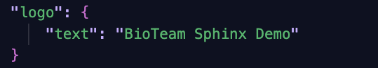
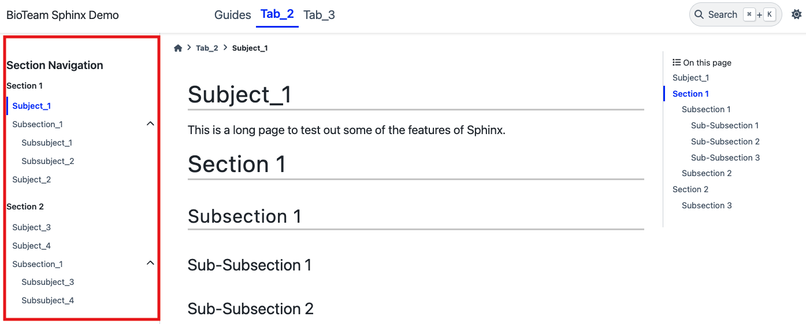

Layout Overview
=============================
.. note::
    :class: sidebar

    The Sphinx theme (`PyData <https://pydata-sphinx-theme.readthedocs.io/en/stable/index.html>`_ in our case) can also affect how documents are shown in the layout.

The documentation you see on this website is built from the `docs <https://github.com/bioteam/sphinx-documentation-demo/tree/main/docs>`_ directory located in the project.

Sphinx compiles the :term:`rST` files inside of this directory and generates static HTML files.
The file layout of the :code:`docs/` directory, along with "toctrees" (which we will cover this later), will **determine the website layout of the documentation**.

Therefore it's important to understand how to organize files within the :code:`docs/` directory so that Sphinx knows where to display them.
We'll cover this over the course of several short tutorials so that you can learn how to:

..
    .. list-table:: 
        :header-rows: 1

        * - **Add a new...**
        * - Tab to the top navigation bar
        * - Page to the left navigation bar
        * - Section to the left navigation bar

* Add a new tab to the top navigation bar
* Add a new page to the left navigation bar
* Add a new section to the left navigation bar

Before that, we review each of the major layout components in the sections below.

Top Navigation Bar
==================

.. figure:: images/layout_top.png
        :class: sd-border-2

        The top navigation bar (highlighted in red)

Logo
----

The "logo" is located in the upper-left-hand corner of the page.
Typically this is just text, but you can also add an icon.
To change the text that you see:

1. Go into :code:`docs/conf.py`
2. In html_theme_options...
3. Change the text stored in the "logo" key: 

.. seealso::

    `PyData's guide on changing the logo <https://pydata-sphinx-theme.readthedocs.io/en/stable/user_guide/branding.html>`_

Tabs
----
.. figure:: images/tabs.png
    :class: sd-border-2

    This project has three tabs, although two of them are for demonstration purposes.

You can organize content into different "tabs".
For example, a code project could be partitioned into a "Tutorials" tab (for in-depth documentation) and an "API" tab (for documenting specific functions)

A tab is created for each "toctree" in the root index file :code:`docs/index.rst`. 
This will be covered in a later tutorial.

.. todo::

    Link to the tabs tutorial

Search Bar
----------
.. warning::
    :class: sidebar

    The search bar doesn't work well when you are viewing documentation **locally** on your computer.

Sphinx comes with built-in search functionality. 
Users that enter text into the search bar in the upper-right-hand corner can search across multiple documentation pages.

Left Navigation Bar
===================

        The left navigation bar (highlighted in red)

The left navigation bar allows users to navigate between documents that have been indexed within a "toctree" (more on this later). 
Each tab will have its own left navigation bar, allowing you to organize :term:`rST` files into one "folder" per tab.

Right Navigation Bar
===================
.. figure:: images/layout_right.png
        :class: sd-border-2

        The right navigation bar (highlighted in red)

The right navigation bar allows users to navigation between **different sections within the current page**.
This is automatically generated based on section headers specified within the page's :term:'rST' file.

..
    .. image:: images/tab2_top.png
        :class: sd-border-2

    | 

