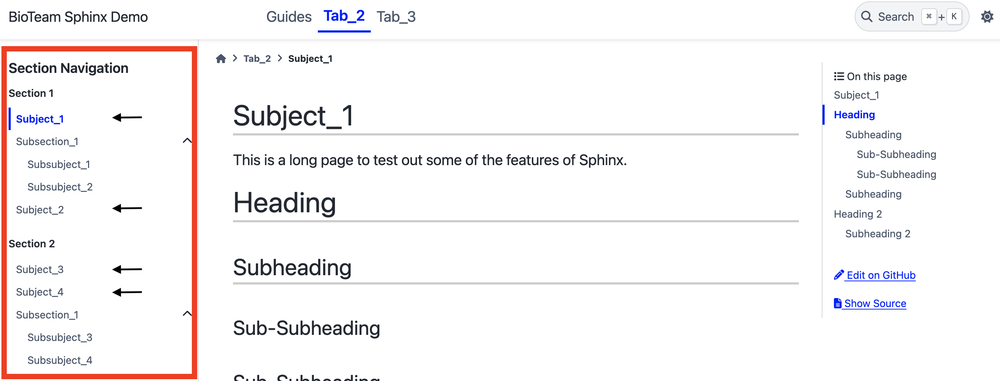

Modifying Sections
===================

.. admonition:: Use the Source!
    :class: sidebar tip

    If you look to the sidebar on the right, you will see a link called :code:`Show Source`.  
    You can click on it to see the source :term:`rST` used to create the current page.

It's often the case that you'll want to organize the contents of a tab (see :doc:`the previous walkthrough on adding a new tab <walkthrough_adding_new_tab>`).
We'll be covering the following scenarios:

1. How to add a new section
2. How to add a sub-section (section nested in a section)

Exploring the left navigation layout
====================================
For this walkthrough, we'll be using the layout of the :code:`Tab_2` tab to understand how sections are organized.

    The four "subject" documents with the arrows next to them are "top-level documents". 

This layout relates to the file tree rooted at :code:`sphinx-documentation-demo/docs/tab_2`: 

.. code-block::

    📦tab_2
    ┣ 📂subsection_1
    ┃ ┣ 📜index.rst
    ┃ ┣ 📜subsubject_1.rst
    ┃ ┗ 📜subsubject_2.rst
    ┣ 📂subsection_2
    ┃ ┣ 📜index.rst
    ┃ ┣ 📜subsubject_3.rst
    ┃ ┗ 📜subsubject_4.rst
    ┣ 📜index.rst
    ┣ 📜subject_1.rst       <- top level
    ┣ 📜subject_2.rst       <- top level
    ┣ 📜subject_3.rst       <- top level
    ┗ 📜subject_4.rst       <- top level

The subjects with the arrows are "top level documents".

Organizing Top-Level Sections
-----------------------------
So how does Sphinx know how to organize those top-level documents into **Section 1** and **Section 2**?

Let's look at :code:`sphinx-documentation-demo/docs/tab_2/index.rst`:

.. code-block::
    :emphasize-lines: 3,11
    :linenos:

    .. toctree::
        :maxdepth: 1
        :caption: Section 1

        subject_1
        subsection_1/index
        subject_2

    .. toctree::
        :maxdepth: 1
        :caption: Section 2

        subject_3
        subject_4
        subsection_2/index

* There are two toctrees contained in this index.
* Each toctree corresponds to a **section** within **Tab_2**

  * The name of the section is determined by the :code:`\:caption\:` :term:`role` (see the two lines highlighted in yellow)
* **subject_1** and **subject_2** belong to the first toctree ("Section 1")
* **subject_3** and **subject_4** belong to the second toctree ("Section 2")

Adding New Section
==================
A quick way to demonstrate adding a new section is by adding a new :term:`toctree` to the index at :code:`docs/tab_2/index.rst`.
We will also move an existing document to the new section. 

Change the toctrees in :code:`docs/tab_2/index.rst` to the following:

.. code-block::
    :emphasize-lines: 19,21
    :linenos:

    .. toctree::
        :maxdepth: 1
        :caption: Section 1

        subject_1
        subsection_1/index
        subject_2

    .. toctree::
        :maxdepth: 1
        :caption: Section 2

        subject_3
        subject_4
        subsection_2/index

    .. toctree::
        :maxdepth: 1
        :caption: My New Section

        subject_4

.. admonition:: Remember to build!
    :class: sidebar warning

    You need to use :code:`sphinx-build` or :code:`sphinx-autobuild` to build documentation before you notice any changes in the following steps.

* The last :term:`toctree` is the new one added for this demonstration.
* The first highlighted line will be the title of the section.
* The second highlighted line will be the document (:code:`subject_4`) that's contained in this new section.

  * Notice that you can have the same document in more than one section. Sphinx knows how to link to the same document.

.. figure:: images/guide_add_new_section.png
    :class: sd-border-2

    You should notice a new section in Tab_2.

Adding a New Subsection
=======================
A subsection is nested within an existing section. 
